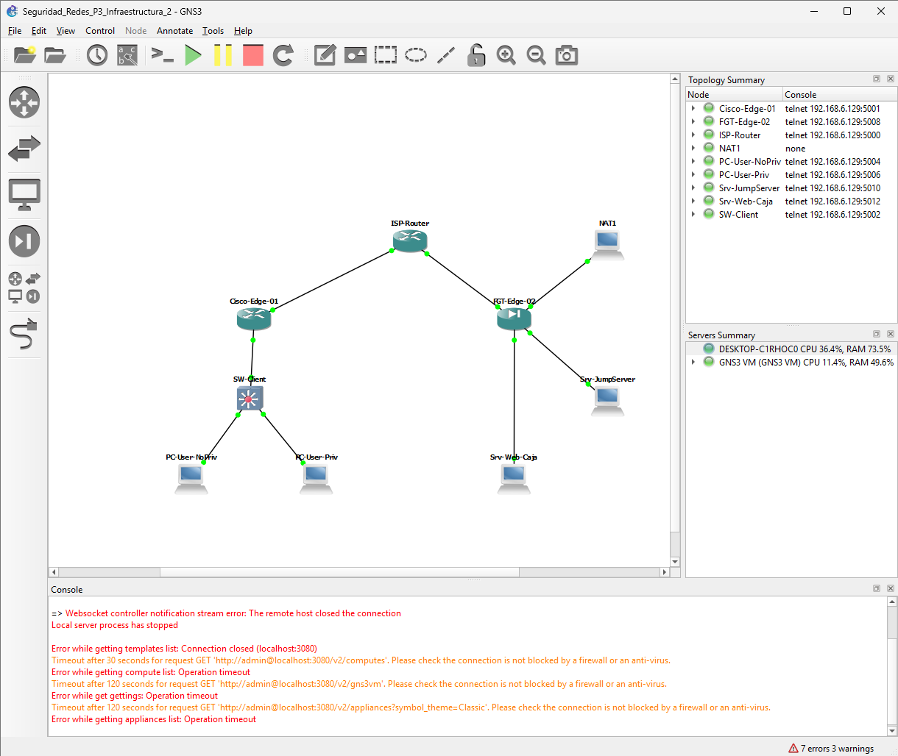
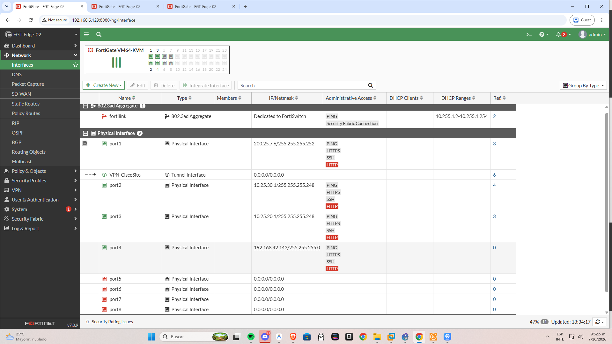
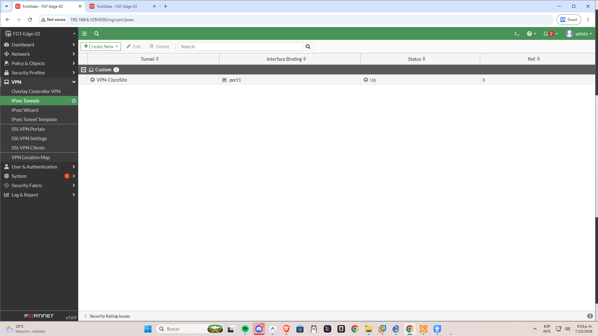
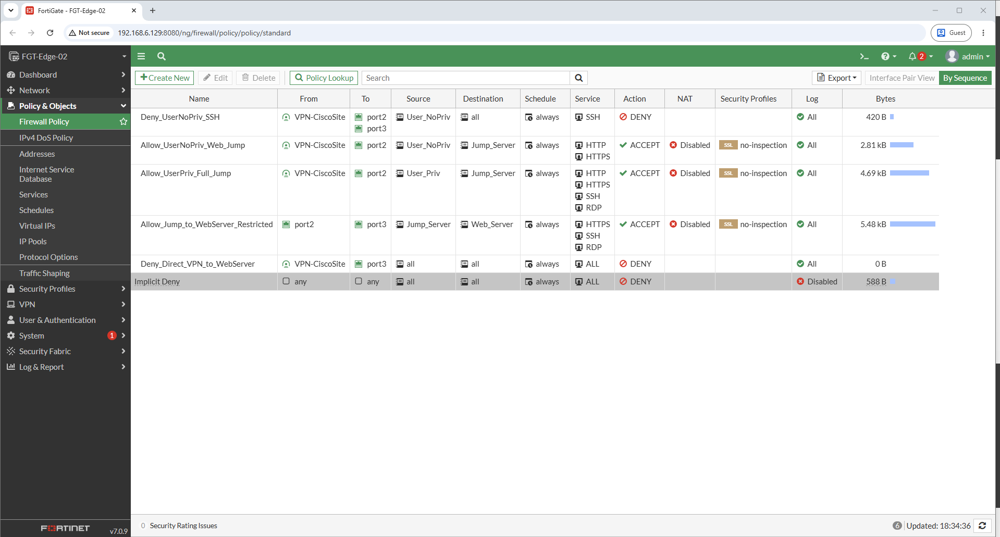
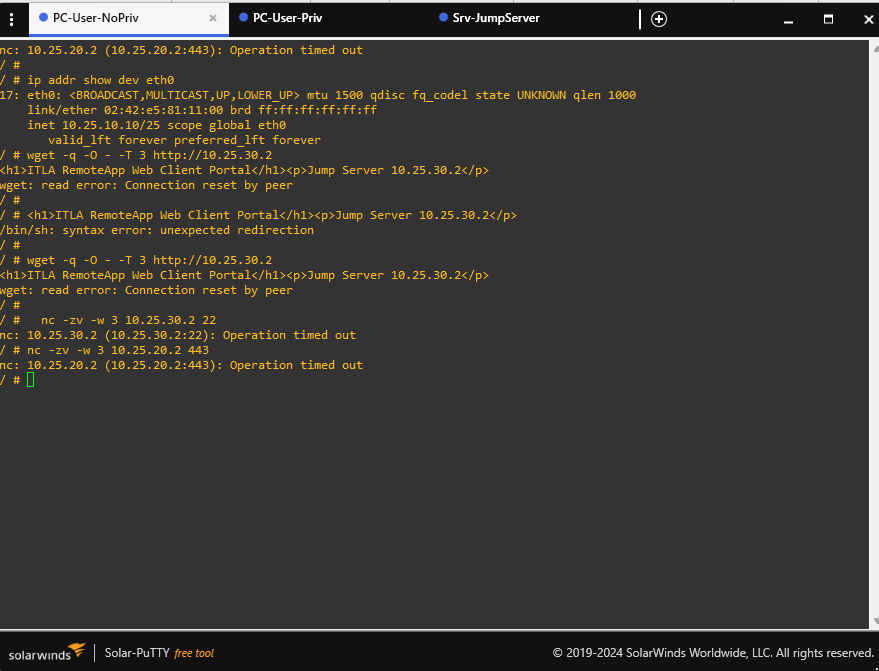
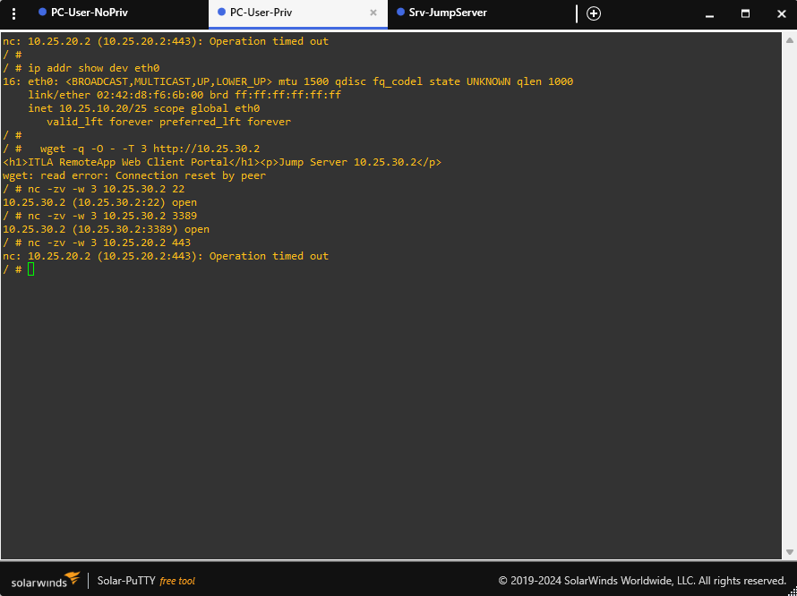
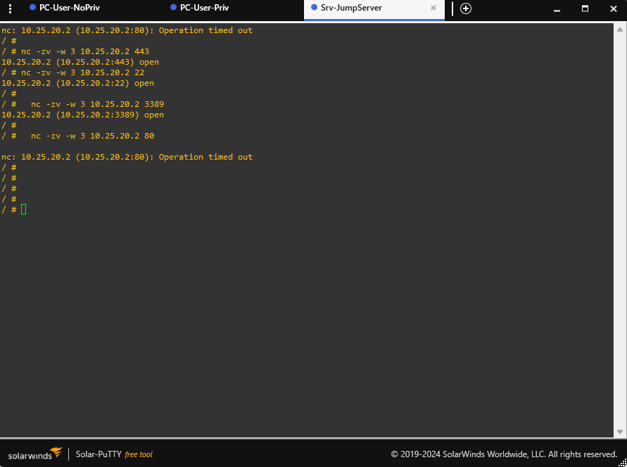

# Práctica 3: Infraestructura 2 - Arquitectura Bastion / Jump Server, VPN IPsec Site-to-Site y Control de Acceso Granular

**Estudiante:** Cristopher Navarro  
**Matrícula:** 2025-0720  
**Asignatura:** Seguridad de Redes  
**Docente:** Jonathan Esteban Rondón Corniel  
**Fecha de Entrega:** Octubre 2026  
**Institución:** Instituto Tecnológico de Las Américas (ITLA)  

---

## 🎥 Video Demostrativo del Laboratorio

[](https://youtu.be/PQEGjyYmG2w)

* **Enlace directo al video en YouTube:** [https://youtu.be/PQEGjyYmG2w](https://youtu.be/PQEGjyYmG2w)
* **Duración:** Menos de 10 minutos.
* **Contenido:** Defensa técnica en vivo con cámara web encendida, verificación de hora y fecha del sistema, demostración del túnel VPN IPsec Site-to-Site activo entre Cisco y FortiGate, gestión del firewall perimetral por su interfaz gráfica Web GUI, verificación del control de acceso basado en privilegios (usuario sin privilegios vs. usuario con privilegios) y confirmación del modelo de servidor de salto (Jump Server / Bastion Host) hacia el servidor crítico de caja.

---

## 1. Propósito del Laboratorio

El objetivo primordial de esta infraestructura consiste en implementar una arquitectura perimetral de **defensa en profundidad** y **acceso condicional de confianza cero (Zero Trust)** para proteger un recurso altamente crítico (Servidor de Caja). 

La solución técnica integra:
1. **Interconexión Segura Site-to-Site:** Despliegue de un túnel cifrado **IPsec VPN** entre una sucursal cliente (enrutador perimetral Cisco 7200) y la sede central protegida por un Next-Generation Firewall (FortiGate 7.0.9) a través de un proveedor simulado de Internet (ISP).
2. **Arquitectura Bastion Host (Jump Server):** Prohibición terminante de conexiones directas desde los clientes remotos hacia el servidor crítico de caja. Todo acceso administrativo u operativo debe canalizarse forzosamente a través de un servidor intermedio de salto (*Jump Server* / *Bastion Host*).
3. **Control Granular por Niveles de Privilegio:**
   * **Usuario Sin Privilegios (`PC-User-NoPriv`):** Acceso restringido exclusivamente al portal web del Jump Server (HTTP 80) para consumo de servicios RemoteApp; bloqueo explícito y total de conexiones por consola SSH (puerto 22).
   * **Usuario Con Privilegios (`PC-User-Priv`):** Acceso autorizado completo al Jump Server para sesiones administrativas vía HTTP 80, PuTTY SSH (puerto 22) y Escritorio Remoto RDP (puerto 3389).
4. **Endurecimiento de Comunicaciones en la Zona Interna:** El Jump Server únicamente puede gestionar el Servidor Web de Caja a través de protocolos seguros y cifrados (HTTPS 443, SSH 22, RDP 3389). El tráfico no cifrado (HTTP 80) queda estrictamente restringido y bloqueado en el firewall perimetral.

---

## 2. Diagrama de la Topología y Arquitectura de Red

La topología implementada en GNS3 presenta la siguiente arquitectura física y lógica:

```mermaid
graph TD
    subgraph SUCURSAL_CLIENTE ["Sucursal Cliente (VLAN 10 / Red 10.25.10.0/25)"]
        PC_NOPRIV["PC-User-NoPriv<br/>10.25.10.10/25 (DHCP)<br/>Perfil: Estándar"]
        PC_PRIV["PC-User-Priv<br/>10.25.10.20/25 (DHCP)<br/>Perfil: Administrador"]
        SW_CLIENT["SW-Client (Cisco IOSvL2)<br/>Gi1/1: Acceso VLAN 10<br/>Gi2/1: Acceso VLAN 10<br/>PortFast & BPDU Guard"]
        CISCO_EDGE["Cisco-Edge-01 (Cisco 7200)<br/>Fa1/0.10: 10.25.10.1 (GW / DHCP)<br/>Fa0/0: 200.25.7.2/30 (WAN)"]
        
        PC_NOPRIV ---|Gi1/1| SW_CLIENT
        PC_PRIV ---|Gi2/1| SW_CLIENT
        SW_CLIENT ---|Gi0/0 Trunk| CISCO_EDGE
    end

    subgraph WAN_INTERNET ["Nube Pública / WAN"]
        ISP["ISP-Router (Cisco 7200)<br/>Fa0/0: 200.25.7.1/30<br/>Fa1/0: 200.25.7.5/30"]
    end

    subgraph SEDE_CENTRAL ["Sede Central / Centro de Datos"]
        FGT["FGT-Edge-02 (FortiGate 7.0.9)<br/>port1: 200.25.7.6/30 (WAN)<br/>port2: 10.25.30.1/29 (Jump LAN)<br/>port3: 10.25.20.1/29 (Caja LAN)<br/>port4: 192.168.42.143 (MGMT GUI)"]
        
        subgraph ZONA_JUMP ["Zona Jump Server (Subred 10.25.30.0/29)"]
            JUMP["Srv-JumpServer (Bastion Host)<br/>IP: 10.25.30.2/29<br/>Servicios: HTTP 80, SSH 22, RDP 3389"]
        end

        subgraph ZONA_CAJA ["Zona Servidor de Caja (Subred 10.25.20.0/29)"]
            CAJA["Srv-Web-Caja (Servidor Crítico)<br/>IP: 10.25.20.2/29<br/>Servicios: HTTPS 443, SSH 22, RDP 3389"]
        end

        FGT ---|port2| JUMP
        FGT ---|port3| CAJA
    end

    CISCO_EDGE ---|Fa0/0 (200.25.7.2)| ISP
    ISP ---|Fa1/0 (200.25.7.5)| FGT
    
    CISCO_EDGE -.->|Túnel IPsec Cifrado (Site-to-Site)| FGT
```



---

## 3. Plan de Direccionamiento IP (Matrícula: 2025-0720)

El direccionamiento IP de la infraestructura fue calculado tomando como base mi matrícula de estudiante **2025-0720**, utilizando los prefijos `10.25.x.x` para las redes privadas y `200.25.7.x` para el tránsito WAN:

| Segmento / Función | Subred | Máscara de Red | Gateway Predeterminado | Hosts / Equipos Clave | Método de Asignación |
| :--- | :--- | :--- | :--- | :--- | :--- |
| **WAN Cliente (Cisco -> ISP)** | `200.25.7.0/30` | `255.255.255.252` | `200.25.7.1` (ISP Fa0/0) | `200.25.7.2` (Cisco Fa0/0) | Estático |
| **WAN Sede (FortiGate -> ISP)** | `200.25.7.4/30` | `255.255.255.252` | `200.25.7.5` (ISP Fa1/0) | `200.25.7.6` (FortiGate port1) | Estático |
| **VLAN 10 (Clientes Sucursal)** | `10.25.10.0/25` | `255.255.255.128` | `10.25.10.1` (Cisco Fa1/0.10) | `10.25.10.10` (PC NoPriv)<br>`10.25.10.20` (PC Priv) | DHCP (Cisco 7200) |
| **Zona Jump Server (Sede)** | `10.25.30.0/29` | `255.255.255.248` | `10.25.30.1` (FortiGate port2) | `10.25.30.2` (Srv-JumpServer) | Estático |
| **Zona Servidor de Caja (Sede)** | `10.25.20.0/29` | `255.255.255.248` | `10.25.20.1` (FortiGate port3) | `10.25.20.2` (Srv-Web-Caja) | Estático |
| **Gestión Web GUI FortiGate** | `192.168.42.0/24` | `255.255.255.0` | `192.168.42.1` | `192.168.42.143` (port4) | Estático / Bridge |

---

## 4. Configuración y Políticas en FortiGate (Demostración GUI)

Toda la administración del firewall perimetral FortiGate 7.0.9 fue efectuada y demostrada a través de la interfaz gráfica web (**Web GUI**).

### 4.1. Interfaces de Red
En el menú **Network -> Interfaces**, definí las zonas e interfaces físicas requeridas:
* **port1 (WAN):** Conexión pública hacia el ISP con IP `200.25.7.6/30`.
* **port2 (Jump Server LAN):** Interfaz dedicada hacia la zona del servidor de salto con IP `10.25.30.1/29`.
* **port3 (Web Server Caja LAN):** Interfaz aislada hacia la zona del servidor crítico con IP `10.25.20.1/29`.
* **port4 (Management):** Interfaz de administración en banda fuera de simulación (`192.168.42.143/24`) habilitando acceso `HTTPS`, `HTTP`, `PING` y `SSH`.



---

### 4.2. Túnel VPN IPsec Site-to-Site (Cisco <-> FortiGate)
En **VPN -> IPsec Tunnels**, establecí el túnel cifrado hacia el enrutador perimetral Cisco:
* **Nombre de Fase 1:** `VPN_TO_CISCO`
* **Dirección IP del Gateway Remoto:** `200.25.7.2` (Cisco Fa0/0) sobre la interfaz local `port1`.
* **Autenticación:** Clave precompartida (*Pre-Shared Key*): `ITLA2025VPNKey`.
* **Propuesta IKE Fase 1:** Cifrado DES, Hashing SHA1, Diffie-Hellman Group 14 (2048-bit), Lifetime 86400s.
* **Fase 2 (Quick Mode):** Protocolo ESP con DES y SHA1, PFS activo con Diffie-Hellman Group 14, Selectores de tráfico configurados para enrutar el tráfico de los clientes (`10.25.10.0/25`) hacia los segmentos protegidos (`10.25.30.0/29` y `10.25.20.0/29`).
* **Estado:** El túnel permanece en estado **UP** y activo de forma permanente.



---

### 4.3. Matriz de Políticas de Seguridad (Firewall Policies)
En **Policy & Objects -> Firewall Policy**, definí la matriz jerárquica de políticas de seguridad para dar estricto cumplimiento a la matriz de acceso de la práctica:

| ID | Nombre de Política | Interfaz Origen | Interfaz Destino | Origen | Destino | Servicios | Acción | Propósito de Seguridad |
| :-: | :--- | :--- | :--- | :--- | :--- | :--- | :-: | :--- |
| **1** | `Deny_UserNoPriv_SSH` | `VPN_TO_CISCO` | `port2` (Jump LAN) | `PC_User_NoPriv`<br>(`10.25.10.10`) | `Srv_JumpServer`<br>(`10.25.30.2`) | `SSH` (22) | **DENY** | **Restricción Explícita:** Bloquea terminantemente el acceso SSH del usuario estándar hacia el Jump Server. |
| **2** | `Allow_UserNoPriv_Web_Jump` | `VPN_TO_CISCO` | `port2` (Jump LAN) | `PC_User_NoPriv`<br>(`10.25.10.10`) | `Srv_JumpServer`<br>(`10.25.30.2`) | `HTTP` (80) | **ACCEPT** | **Acceso Portal Web:** Permite al usuario estándar acceder al portal web RemoteApp del Jump Server. |
| **3** | `Allow_UserPriv_Full_Jump` | `VPN_TO_CISCO` | `port2` (Jump LAN) | `PC_User_Priv`<br>(`10.25.10.20`) | `Srv_JumpServer`<br>(`10.25.30.2`) | `HTTP` (80), `SSH` (22), `RDP` (3389) | **ACCEPT** | **Acceso Privilegiado:** Otorga al usuario administrador acceso web, PuTTY SSH y Escritorio Remoto RDP al Jump Server. |
| **4** | `Allow_Jump_to_WebServer_Restricted` | `port2` (Jump LAN) | `port3` (Caja LAN) | `Srv_JumpServer`<br>(`10.25.30.2`) | `Srv_Web_Caja`<br>(`10.25.20.2`) | `HTTPS` (443), `SSH` (22), `RDP` (3389) | **ACCEPT** | **Salto Cifrado Obligatorio:** Permite la gestión segura únicamente por canales cifrados. El tráfico no cifrado HTTP (80) es descartado. |
| **5** | `Deny_Direct_VPN_to_WebServer` | `VPN_TO_CISCO` | `port3` (Caja LAN) | `VPN_Clients_Net`<br>(`10.25.10.0/25`) | `Srv_Web_Caja`<br>(`10.25.20.2`) | `ALL` | **DENY** | **Aislamiento Total del Recurso Crítico:** Prohíbe cualquier intento de acceso directo desde los clientes hacia el servidor de caja sin pasar por el Jump Server. |



---

## 5. Endurecimiento en Enrutadores y Conmutadores Cisco

### 5.1. Enrutador Perimetral Sucursal (`Cisco-Edge-01`)
* **Subinterfaz 802.1Q:** `FastEthernet1/0.10` configurada con `encapsulation dot1Q 10` e IP `10.25.10.1/25`.
* **Servidor DHCP Local:** Pool `VLAN10_POOL` con exclusión de las direcciones de infraestructura (`10.25.10.1` a `10.25.10.9`), gateway `10.25.10.1` y servidor DNS `1.1.1.1`.
* **Criptografía IPsec / IKEv1:**
  * Política ISAKMP: `crypto isakmp policy 10` (encr des, hash sha, group 14, lifetime 86400).
  * Clave precompartida: `crypto isakmp key ITLA2025VPNKey address 200.25.7.6`.
  * Transform-Set: `crypto ipsec transform-set ESP-SET esp-des esp-sha-hmac`.
  * Crypto Map: `crypto map VPN-MAP 10 ipsec-isakmp` con `set pfs group14` aplicado a la interfaz WAN `FastEthernet0/0`.
  * Lista de Control de Acceso Criptográfica: `access-list 100 permit ip 10.25.10.0 0.0.0.127 10.25.20.0 0.0.0.7` y `access-list 100 permit ip 10.25.10.0 0.0.0.127 10.25.30.0 0.0.0.7`.

### 5.2. Conmutador de Acceso Sucursal (`SW-Client`)
* **VLAN Nativa Segura:** Configuración de la VLAN 99 como nativa en el troncal hacia el router (`switchport trunk native vlan 99`).
* **Seguridad de Capa 2 en Puertos de Acceso:**
  * Modo de acceso explícito (`switchport mode access`) en `GigabitEthernet1/1` y `GigabitEthernet2/1`.
  * Desactivación de negociación de troncales (`switchport nonegotiate`).
  * Habilitación de `spanning-tree portfast` para conexión inmediata de estaciones de trabajo.
  * Habilitación de `spanning-tree bpduguard enable` para protección inmediata contra conmutadores falsos (*rogue switches*).

---

## 6. Evidencias de Pruebas de Auditoría y Verificación

### 6.1. Pruebas desde `PC-User-NoPriv` (Usuario Sin Privilegios)
Ejecuté las pruebas de verificación desde la consola de la estación no privilegiada:
1. **Conectividad con Gateway Local:** `ping -c 2 10.25.10.1` -> Éxito total (0% packet loss, RTT ~26 ms).
2. **Acceso Web al Jump Server:** `wget -q -O - -T 3 http://10.25.30.2` -> Éxito, responde el encabezado `<h1>ITLA RemoteApp Web Client Portal</h1>`.
3. **Restricción Explícita de SSH:** `nc -zv -w 2 10.25.30.2 22` -> **Bloqueado por política** (`Operation timed out`). La Política 1 del FortiGate aplicó drop inmediato.
4. **Intento de Acceso Directo al Servidor de Caja:** `nc -zv -w 2 10.25.20.2 443` -> **Bloqueado por política** (`Operation timed out`). La Política 5 impide el salto directo.



---

### 6.2. Pruebas desde `PC-User-Priv` (Usuario Con Privilegios)
Ejecuté las pruebas desde la consola de la estación privilegiada:
1. **Conectividad con Gateway Local:** `ping -c 2 10.25.10.1` -> Éxito total.
2. **Acceso Web al Jump Server:** `wget -q -O - -T 3 http://10.25.30.2` -> Éxito, responde el portal web RemoteApp.
3. **Acceso Administrativo SSH (PuTTY):** `nc -zv -w 2 10.25.30.2 22` -> **Permitido** (`10.25.30.2:22 open`).
4. **Acceso Administrativo RDP:** `nc -zv -w 2 10.25.30.2 3389` -> **Permitido** (`10.25.30.2:3389 open`).
5. **Intento de Acceso Directo al Servidor de Caja:** `nc -zv -w 2 10.25.20.2 443` -> **Bloqueado por política** (`Operation timed out`). La Política 5 impide el salto directo sin autenticación previa en el Jump Server.



---

### 6.3. Pruebas desde `Srv-JumpServer` hacia `Srv-Web-Caja`
Una vez situado en el servidor de salto intermedio, evalué los canales de comunicación hacia el servidor crítico:
1. **Gestión Web Segura:** `nc -zv -w 2 10.25.20.2 443` -> **Permitido** (`10.25.20.2:443 open`).
2. **Gestión Administrativa SSH:** `nc -zv -w 2 10.25.20.2 22` -> **Permitido** (`10.25.20.2:22 open`).
3. **Gestión Administrativa RDP:** `nc -zv -w 2 10.25.20.2 3389` -> **Permitido** (`10.25.20.2:3389 open`).
4. **Restricción de Canal Inseguro HTTP:** `nc -zv -w 2 10.25.20.2 80` -> **Bloqueado por política** (`Operation timed out`). La Política 4 sólo permite puertos cifrados hacia el servidor de caja.



---

## 7. Archivos de Respaldo y Configuraciones Incluidas

Dentro de este repositorio se encuentran todos los archivos fuente generados en el despliegue del laboratorio:

* **Topología Portable / Proyecto GNS3:** [`Seguridad_Redes_P3_Infraestructura_2.gns3`](Seguridad_Redes_P3_Infraestructura_2.gns3)
* **Running-Config ISP-Router:** [`configs/ISP-Router_running_config.txt`](configs/ISP-Router_running_config.txt)
* **Running-Config Cisco-Edge-01:** [`configs/Cisco-Edge-01_running_config.txt`](configs/Cisco-Edge-01_running_config.txt)
* **Running-Config SW-Client:** [`configs/SW-Client_running_config.txt`](configs/SW-Client_running_config.txt)
* **Configuración Completa FortiGate FGT-Edge-02:** [`configs/FortiGate_Edge02_running_config.txt`](configs/FortiGate_Edge02_running_config.txt)

---

## 8. Conclusiones

La implementación de la Infraestructura 2 consolida un diseño perimetral de alta seguridad:
1. **Cumplimiento del Modelo Bastion Host:** Se demostró de manera concluyente que ningún host remoto puede comunicarse directamente con el servidor crítico de caja, neutralizando vectores de ataque directos y movimientos laterales no autorizados.
2. **Defensa por Perfiles de Privilegios:** La granularidad de las políticas del FortiGate permite segmentar con exactitud las funciones laborales de los usuarios finales, garantizando que el usuario estándar sólo interactúe con el portal de aplicaciones web, mientras que el usuario privilegiado posee las facultades necesarias para tareas de mantenimiento.
3. **Cifrado de Extremo a Extremo:** Toda la transmisión a través del proveedor de servicios WAN se encuentra protegida mediante túneles IPsec de alta seguridad, y la interacción interna con el recurso más sensible de la empresa se limita estrictamente a canales cifrados (HTTPS, SSH, RDP).
